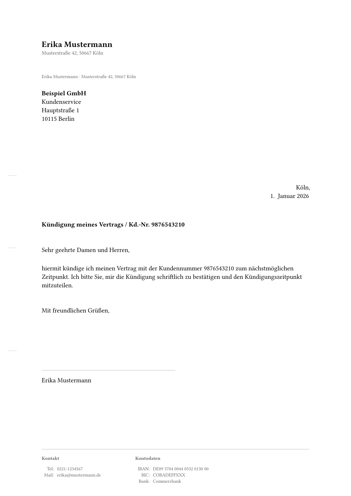

# Briefvorlage

Markdown to PDF letter template using Pandoc and Typst.

## Preview



## Requirements

- pandoc
- typst

## Install Typst

```
curl -fsSL https://typst.community/typst-install/install.sh | sh
```

## Usage

```
pandoc letter.md --template=letter.typ --pdf-engine=typst -o letter.pdf
```

## Frontmatter Variables

### Sender

| Variable | Description | Required | Comment |
|---|---|---|---|
| `from-name` | Sender name | yes | |
| `from-street` | Street name | no | |
| `from-house-number` | House number | no | |
| `from-postcode` | Postal code | no | |
| `from-city` | City | no | Also used as default for `location` |
| `from-phone` | Phone number | no | |
| `from-email` | Email address | no | |
| `bank-iban` | IBAN | no | |
| `bank-bic` | BIC | no | |
| `bank-name` | Bank name | no | |
| `tax-number` | Tax number | no | |

### Recipient

| Variable | Description | Required | Comment |
|---|---|---|---|
| `to-name` | Recipient name | yes | |
| `to-department` | Additional address line | no | e.g. department or "c/o" |
| `to-street` | Street name | no | |
| `to-house-number` | House number | no | |
| `to-postcode` | Postal code | no | |
| `to-city` | City | no | |

### Letter

| Variable | Description | Required | Comment |
|---|---|---|---|
| `lang` | Language code | no | ISO 639-1, default: `de` (only supports `en` and `de` [due to Typst limitations](https://github.com/typst/typst/issues/1537)) |
| `subject` | Subject line | yes | |
| `date` | Letter date | no | Defaults to current date |
| `location` | Location for date line | no | Defaults to `from-city` |
| `opening` | Salutation | yes | |
| `closing` | Closing phrase | yes | |
| `ps` | Postscript | no | |
| `enclosures` | Enclosure list | no | |
